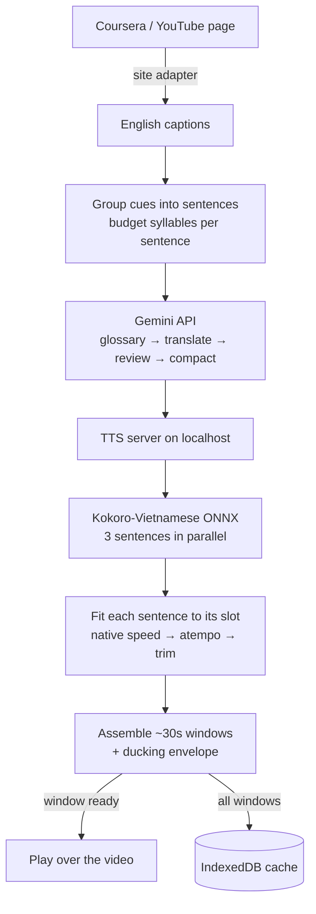

<div align="center">

# Local AI Vietnamese Dubbing

**Watch English lectures in Vietnamese — translated by Gemini, spoken by a model running on your own CPU.**

[](#version-history)
[](LICENSE)
[](extension/manifest.json)
[](server/requirements.txt)
[](#testing)

[Tiếng Việt](README.vi.md) · [Server docs](server/README.md) · [Deployment](deploy/README.md)

</div>

---

## What it does

A Chrome extension that dubs **Coursera lectures** and **YouTube videos** into Vietnamese, in sync with the video timeline.

It reads the video's existing English captions, translates them with the official Gemini API, synthesises speech locally with Kokoro-Vietnamese ONNX, and plays the result on top of the video. Seeking works instantly: the audio is anchored to absolute timestamps, so jumping anywhere is a single assignment rather than a buffer refill.

**Your data stays put.** Only the caption text goes to Gemini for translation. Speech synthesis runs on your own CPU after a one-time model download — the translated text never reaches a speech provider, and the video and audio never leave your machine.

### Highlights

| | |
|---|---|
| 🎧 **Starts in ~4 seconds** | Audio arrives in ~30s windows and plays while the rest is still rendering, instead of waiting ~80s for the whole lecture |
| 🎚️ **Keeps the background** | Music, applause and effects stay audible: the original track is ducked under the dub by an envelope derived from the dub itself, not muted |
| ⚡ **CPU only** | 0.23–0.32× real time on a 6-core laptop, three sentences synthesised in parallel. No GPU, no PyTorch |
| 📝 **Bilingual subtitles** | Vietnamese and the English original, draggable, in three sizes and three colour presets |
| 🔁 **Self-calibrating** | The server measures the voice's real speaking rate each job and feeds it back, so translations are sized for what will actually be spoken |
| 💾 **Cached** | A lecture dubbed once replays instantly, with no further API calls |

---

## How it works



**Timeline anchoring.** Every sentence keeps the absolute start time of the caption it came from. The dub is assembled onto a silent track of exactly the video's length, so `audio.currentTime = video.currentTime − window.start` is always correct — no drift correction needed after a seek.

**Fitting speech into its slot.** A sentence that runs longer than the gap before the next one is re-synthesised at Kokoro's native speed (up to 1.15×, which preserves prosody), then compressed with `atempo` if still over, and only trimmed as a last resort. Sentences borrow the silence that follows them, so most never need any of this.

### Components

```
extension/                  Chrome MV3 extension (no build step)
├── background.js           Service worker: job orchestration, Gemini, TTS client
├── content/content.js      Page UI, playback, subtitle rendering, sync
├── lib/plan.js             Sentence grouping, syllable budgets, prompts
├── lib/sites.js            Per-site adapters (Coursera, YouTube)
├── lib/windows.js          Which audio window covers a timestamp
├── lib/vtt.js              WebVTT parsing and caption discovery
└── lib/cache.js            IndexedDB cache of finished dubs

server/                     FastAPI TTS server, API only
├── main.py                 Routes, job queue, lifecycle, limits
├── kokoro_onnx.py          ONNX inference on numpy alone
├── tts_engine.py           Text normalisation, number reading, WAV output
└── audio_pipeline.py       Slot fitting, windowing, ducking envelope

tests/                      44 JavaScript + 58 Python tests
```

---

## Screenshots

<!--
  Drop PNGs into docs/screenshots/ with these names and they will appear here:
    player.png     — the mic button docked in the player control bar
    subtitles.png  — bilingual subtitles over a lecture
    controls.png   — the floating panel: mode, subtitles, volume, voice
    options.png    — the extension's settings page
-->

| | |
|---|---|
|  |  |
| The mic button sits in the player's own control bar | Vietnamese over the English original |
|  |  |
| Mode, subtitles, volumes, voice | Settings: API keys, server, speaking rate |

The dot on the button reports state at a glance:

| Colour | Meaning |
|---|---|
| 🟡 amber (pulsing) | translating or synthesising, nothing to hear yet |
| 🔵 blue (pulsing) | playing, the rest still rendering |
| 🟢 green | finished, or loaded from cache |
| 🔴 red | failed — the panel says why |

---

## Requirements

- **Chrome** 116+ (Manifest V3, `color-scheme` support)
- **Python** 3.12
- **ffmpeg** on `PATH` — the server refuses to start without it
  - Windows: `winget install Gyan.FFmpeg`
  - Debian/Ubuntu: `apt install ffmpeg`
  - macOS: `brew install ffmpeg`
- A **Gemini API key** ([aistudio.google.com](https://aistudio.google.com/apikey))
- ~300 MB for the Kokoro model, downloaded once on first run

---

## Installation

### 1. TTS server

```bash
cd server
python -m venv .venv
.venv\Scripts\pip install -r requirements.txt      # Windows
# .venv/bin/pip install -r requirements.txt        # macOS/Linux

copy .env.example .env                              # Windows
# cp .env.example .env                              # macOS/Linux
```

Generate an API key and put it in `server/.env` — the server refuses to start without one, because it is reachable by anything that can open a socket to it:

```bash
python -c "import secrets; print(secrets.token_hex(16))"
```

Start it:

```bash
.venv\Scripts\python main.py
```

Wait for `Engine sẵn sàng: Kokoro-Vietnamese ONNX (CPU, local)`. The first start downloads the model.

### 2. Extension

1. Open `chrome://extensions`
2. Turn on **Developer mode**
3. **Load unpacked** → select the `extension/` folder
4. Open the extension's **Options** and fill in:
   - **Gemini API key**
   - **Server API key** — the same value as `API_KEY` in `server/.env`
5. Click **Check server** and **Load voices** to confirm the connection

### 3. Use it

Open a Coursera lecture or a YouTube video that has English captions and click the mic button in the player's control bar. On Coursera, turn captions (CC) on first. On YouTube the extension opens the transcript panel itself; if that panel shows a language other than English, switch it and click again.

> **After changing the extension's code, reload the extension _and_ hard-reload the page** (Ctrl+Shift+R). Chrome cannot replace a content script already injected into an open tab; the extension detects the mismatch and says so rather than running a job that could never play.

---

## Configuration

### Extension (Options page)

| Setting | Default | Notes |
|---|---|---|
| Gemini API key | — | Required. Model is fixed to `gemini-3.1-flash-lite` |
| Server URL | `http://127.0.0.1:18765` | |
| Server API key | — | Must match `API_KEY` in `server/.env` |
| Voice | `diem_trinh` | 14 Kokoro voices |
| Syllables per second | `3.8` | Self-calibrates after each job; only edit to override |

### Server (`server/.env`)

| Variable | Default | Purpose |
|---|---|---|
| `API_KEY` | — | **Required.** Every route is locked behind `X-API-Key` |
| `HOST` / `PORT` | `127.0.0.1` / `18765` | Bind address |
| `KOKORO_VOICE` | `diem_trinh` | Default voice |
| `SYNTH_WORKERS` | `3` | Sentences synthesised in parallel |
| `SYNTH_TIMEOUT_SEC` | `300` | A sentence past this marks the engine wedged |
| `FFMPEG_TIMEOUT_SEC` | `120` | Per ffmpeg call |
| `JOB_RETENTION_MIN` | `60` | Finished jobs and their audio are swept after this |
| `MAX_PENDING_JOBS` | `4` | Queue ceiling; beyond it, HTTP 429 |
| `MAX_BODY_MB` | `16` | Enforced on bytes received, not on the declared length |
| `ENABLE_DOCS` | `0` | Swagger UI cannot be locked by API key, so it is off by default |
| `ORT_THREADS` | unset | Bound onnxruntime's threads inside a CPU-limited container |

### API

All routes require `X-API-Key`.

```
GET    /api/health                  loading | ready | error
GET    /api/voices                  available Kokoro voices
POST   /api/preview                 one sentence → WAV, for auditioning a voice
POST   /api/synthesize              → { jobId }
GET    /api/job/{jobId}             status, progress, windows as they become ready
DELETE /api/job/{jobId}             stop a running job
GET    /audio/{jobId}/w{i}.{ext}    one ~30s window of Opus (or MP3)
```

---

## Performance

Measured on an AMD Ryzen 5 5600H (6 cores / 12 threads), 6-minute lecture, 50 sentences:

| | |
|---|---|
| Translation (Gemini, 2 chunks) | ~15 s |
| Synthesis, 3 parallel workers | ~45 s |
| **Time until the first audio plays** | **~4 s** |
| Real-time factor | 0.23–0.32× |
| Peak server memory, 2-hour video | 0.6 MB (streamed, not buffered) |
| Installed Python dependencies | 282 MB (no torch, transformers or gradio) |

Thread scaling on the same machine, same corpus:

| ONNX threads × workers | RTF |
|---|---|
| 6 × 1 | 0.397 |
| 3 × 2 | 0.303 |
| 1 × 6 | 0.266 |
| **6 × 3** (default) | **0.232** |

---

## Testing

```bash
node --test tests/*.test.js                                       # 44 tests
server/.venv/Scripts/python -m unittest discover -s tests -t tests  # 58 tests
```

The JavaScript tests run `background.js` and `content.js` for real, against a mocked `chrome`, `fetch` and DOM — a whole job goes through the service worker, and the content script builds audio windows, switches between them and reports status. The Python tests cover the API contract (auth, limits, job lifecycle, cancellation), the audio pipeline (timeline assembly, ducking, windowing) and the voicepack loader against malicious files.

---

## Version history

| Version | Highlights |
|---|---|
| **0.4.0** | Progressive playback in ~30s windows · parallel synthesis · job cancellation · Vietnamese number reading · status colours on the button |
| 0.3.0 | Torch-free ONNX inference (1079 MB → 282 MB) · streamed timeline assembly · request-edge hardening · test suite |
| 0.2.0 | YouTube support via a site adapter layer · background ducking · borrowed silence · rate self-calibration |
| 0.1.0 | Coursera, Gemini translation, Kokoro ONNX synthesis, absolute-time playback |

---

## Known limitations

- Kokoro voice quality varies; audition the voices on your own material.
- A sentence that still overruns its slot after speed-up and compression is trimmed; the panel reports how many were cut.
- YouTube timestamps come from the transcript panel and are accurate to the second, so anchoring there is coarser than on Coursera, which provides real WebVTT.
- Translation quality depends on Gemini and on the captions themselves; auto-generated captions without punctuation produce longer, less well-formed sentences.
- A wedged engine requires restarting the server — the timeout reports it rather than recovering on its own.

---

## Credits

Speech synthesis uses [Kokoro-Vietnamese](https://github.com/iamdinhthuan/Kokoro-Vietnamese) (Apache-2.0). The ONNX inference layer in `server/kokoro_onnx.py` is an independent reimplementation of that project's ONNX path, written to drop its gradio, torch and transformers dependencies; it produces the same audio. Grapheme-to-phoneme conversion uses [vig2p](https://pypi.org/project/vig2p/).

---

## Author

**Hà Trọng Nguyên** — [github.com/htrnguyen](https://github.com/htrnguyen)

Part of **AIAI Lab** — [github.com/AIAI-Laboratory](https://github.com/AIAI-Laboratory)

## License

Copyright © 2026 Hà Trọng Nguyên, AIAI Lab.

Licensed under the [Apache License 2.0](LICENSE). Apache-2.0 was chosen because this project reimplements part of Kokoro-Vietnamese, which carries the same licence.
