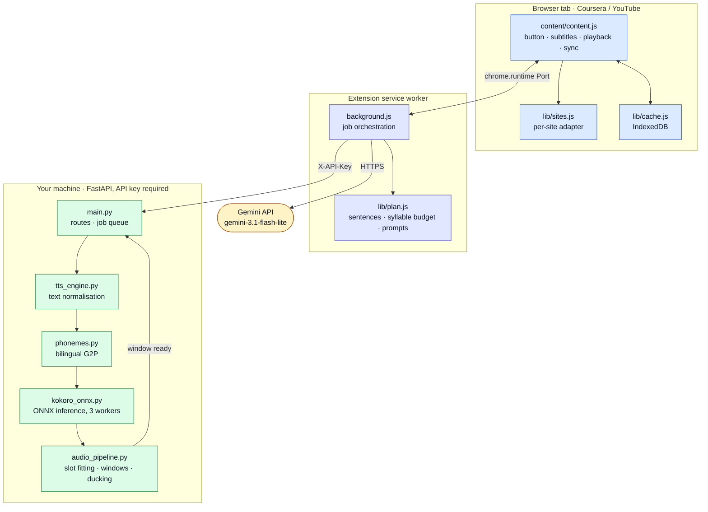
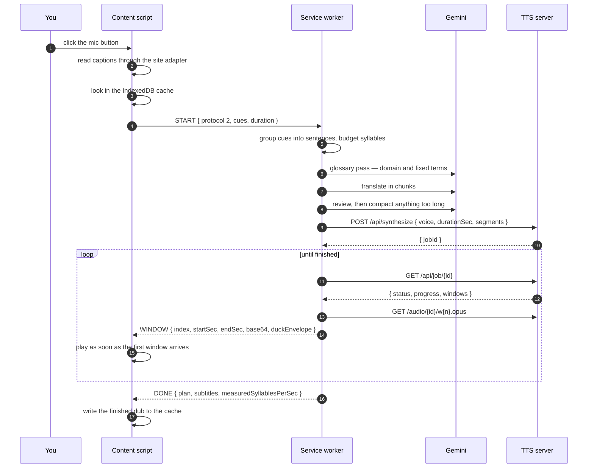
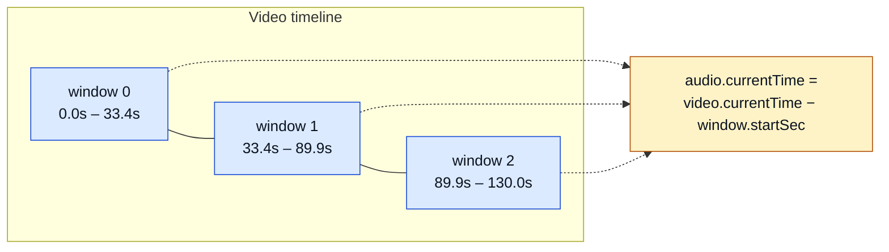
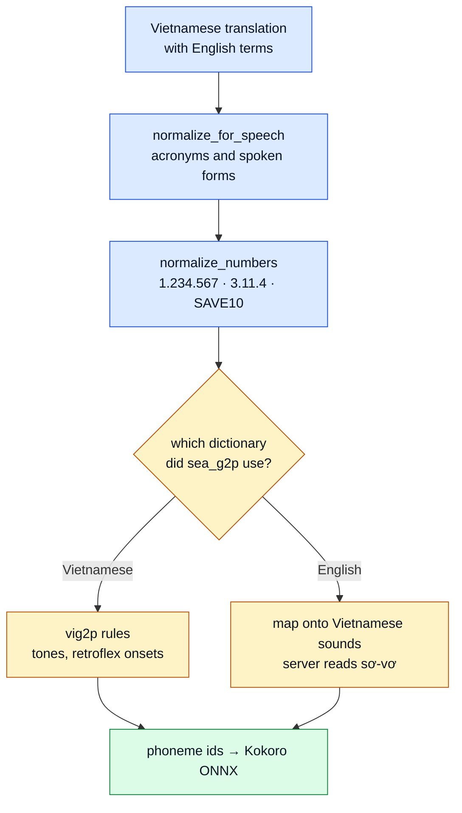
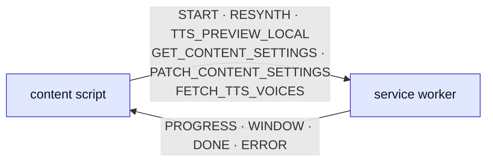
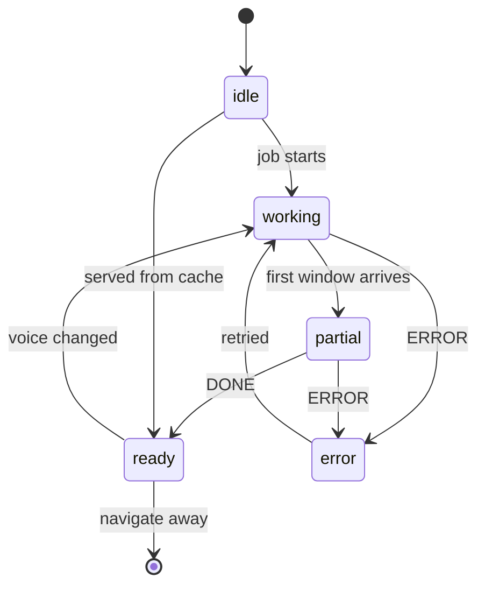

<div align="center">

# Local AI Vietnamese Dubbing

**Watch English lectures in Vietnamese — translated by Gemini, spoken by a model running on your own CPU.**

[](#version-history)
[](LICENSE)
[](extension/manifest.json)
[](server/requirements.txt)
[](#testing)

[Tiếng Việt](README.vi.md) · [Server reference](server/README.md) · [Remote deployment](deploy/README.md)

</div>

---

## Contents

- [What it does](#what-it-does)
- [Architecture](#architecture)
- [How a dubbing job runs](#how-a-dubbing-job-runs)
- [Timeline anchoring](#timeline-anchoring)
- [Speech quality](#speech-quality)
- [Repository layout](#repository-layout)
- [Requirements](#requirements)
- [Installation](#installation)
- [Using it](#using-it)
- [Configuration](#configuration)
- [Server API](#server-api)
- [Extension internals](#extension-internals)
- [Performance](#performance)
- [Security model](#security-model)
- [Testing](#testing)
- [Troubleshooting](#troubleshooting)
- [Known limitations](#known-limitations)
- [Version history](#version-history)
- [Credits and licence](#credits-and-licence)

---

## What it does

A Chrome extension that dubs **Coursera lectures** and **YouTube videos** into Vietnamese, in sync with the video timeline.

It reads the video's existing English captions, translates them with the official Gemini API, synthesises speech locally with Kokoro-Vietnamese ONNX, and plays the result over the video. Seeking is instant: audio is anchored to absolute timestamps, so jumping anywhere is a single assignment rather than a buffer refill.

**Your data stays put.** Only caption text goes to Gemini. Speech synthesis runs on your own CPU after a one-time model download — the translated text never reaches a speech provider, and neither video nor audio leaves the machine.

|                               |                                                                                                                                                          |
| ----------------------------- | -------------------------------------------------------------------------------------------------------------------------------------------------------- |
| **Starts in ~4 seconds**      | Audio arrives in ~30-second windows and plays while the rest is still rendering, instead of waiting ~80 seconds for the whole lecture                     |
| **Keeps the background**      | Music, applause and effects stay audible: the original track is ducked under the dub by an envelope derived from the dub itself, not muted                |
| **CPU only**                  | 0.23–0.32× real time on a 6-core laptop, three sentences synthesised in parallel. No GPU, no PyTorch                                                      |
| **Reads mixed text properly** | Vietnamese numbers are spelled out, and English terms are pronounced the way a Vietnamese speaker says them rather than through Vietnamese spelling rules |
| **Bilingual subtitles**       | Vietnamese and the English original, draggable, three sizes and three colour presets                                                                     |
| **Self-calibrating**          | The server measures the voice's real speaking rate each job and feeds it back, so translations are sized for what can actually be spoken                  |
| **Cached**                    | A lecture dubbed once replays instantly, with no further API calls                                                                                       |

---

## Architecture

Three processes, one of them remote. The browser holds the interface and playback, the local server holds the model, and Gemini is the only network dependency.



---

## How a dubbing job runs



The stages map onto the percentages the panel shows: plan 5, glossary 8–10, translate 12–50, review 49–52, compact 51, synthesise 55–95.

---

## Timeline anchoring

Every sentence keeps the absolute start time of the caption it came from. The dub is assembled onto a silent track exactly as long as the video, then cut into windows of about 30 seconds. Boundaries always fall on a sentence start, and window 0 starts at second 0 — never at the first sentence — so one subtraction locates playback.



**Measured, not assumed.** Feeding 14 sentences at known timestamps through `plan_windows` and `assemble_timeline`, then locating every onset in the rendered track, gives a worst-case placement error of **one sample — 0.04 ms** at 24 kHz. Windows tile the video with no gap and no overlap.

The page keeps that alignment while playing:

| Drift between dub and video | What happens                                           |
| --------------------------- | ------------------------------------------------------ |
| under 40 ms                 | left alone — the deadband                              |
| 40–300 ms                   | `playbackRate` trimmed by up to ±5%, too small to hear |
| over 300 ms                 | `currentTime` reassigned outright                      |

The check runs every 250 ms and on `seeking`, `ratechange` and `play`. A seek is never a resync problem: the formula gives the right position immediately.

**Fitting speech into its slot.** A sentence longer than the gap before the next one is re-synthesised at Kokoro's native speed (up to 1.15×, which preserves prosody), then compressed with `atempo` if still over, and trimmed only as a last resort. Each sentence borrows the silence that follows it, so most need none of this.

**Ducking.** The server derives an RMS envelope from the dub itself (20 fps, 0.08 s attack, 0.40 s release) and ships it with each window. The page multiplies the video's own volume by it: 0.10 while the dub speaks, 0.35 in the gaps, so music and applause stay present.

---

## Speech quality

Text takes three passes before the model sees it, because a Vietnamese G2P applied naively to mixed text mispronounces both halves.



**Numbers.** `vig2p` has no reading for digits — `1000` came out as the phoneme string `→000`. Digits are now spelled out before G2P: grouped thousands (`1.234.567`), version numbers (`3.11.4`), decimals, and letter-digit forms such as `SAVE10`.

**English words.** `sea_g2p` looks each word up separately and already returns English IPA for `server` and Vietnamese for `chúng`. The damage was downstream: `vig2p.fix_phonemes` applies Vietnamese rules to every word, and it treats `ɜ` as a tone mark — which is what sea_g2p uses for a rising tone. In English, `ɜː` is a real vowel:

| Word     | Before                              | After             |
| -------- | ----------------------------------- | ----------------- |
| server   | `ʂˈ↗ːvɚ` — vowel replaced by a tone | `sˈəvə`, "sơ-vơ"  |
| learning | `lˈ↗ːnɪŋ` — no vowel left at all    | `lˈəniŋ`          |
| save     | `ʂˈeɪv` — retroflex Vietnamese *s*  | `sˈeiv`           |

The second half is the voice itself. Across the 585 accented Vietnamese words in this repository, sea_g2p never emits `ʊ ʌ ð ɚ ɾ ᵻ ʒ ɑ ɡ`, nor `iː uː oʊ aɪ aʊ dʒ`. The model has vocabulary entries for them but never heard them while learning, so it renders them unpredictably. English phonemes are therefore rewritten into sounds the voice knows — `machine` reads "ma-sin", `the` reads "đờ". A word ambiguous between the two languages (`set`, `map`) stays on the Vietnamese path, where both readings agree anyway.

---

## Repository layout

```
extension/                  Chrome MV3 extension, no build step
├── manifest.json           Permissions, content script matches, version
├── background.js           Service worker: jobs, Gemini, TTS client
├── content/                Page interface, playback, subtitles, sync
├── options/                Settings page
├── popup/                  Toolbar popup: subtitles, volumes, voice
└── lib/
    ├── plan.js             Sentence grouping, syllable budgets, prompts
    ├── sites.js            Per-site adapters (Coursera, YouTube)
    ├── windows.js          Which window covers a timestamp, ducking gain
    ├── vtt.js              WebVTT parsing and caption discovery
    ├── cache.js            IndexedDB cache of finished dubs
    └── theme.js            Shared theme handling

server/                     FastAPI TTS server, API only
├── main.py                 Routes, job queue, lifecycle, limits
├── auth.py                 X-API-Key on every route
├── tts_engine.py           Text normalisation, number reading, WAV output
├── phonemes.py             Bilingual grapheme-to-phoneme conversion
├── kokoro_onnx.py          ONNX inference on numpy alone
├── audio_pipeline.py       Slot fitting, windowing, ducking envelope
└── .env.example            Every setting, documented

tests/                      44 JavaScript + 65 Python tests
deploy/                     Running the server on another machine
```

---

## Requirements

- **Chrome** 116+ (Manifest V3)
- **Python** 3.12
- **ffmpeg** on `PATH` — the server refuses to start without it
  - Windows: `winget install Gyan.FFmpeg`
  - Debian/Ubuntu: `apt install ffmpeg`
  - macOS: `brew install ffmpeg`
- A **Gemini API key** ([aistudio.google.com](https://aistudio.google.com/apikey))
- ~300 MB for the Kokoro model, downloaded once on first run

---

## Installation

### 1. TTS server

```bash
cd server
python -m venv .venv
.venv/Scripts/pip install -r requirements.txt      # Windows
# .venv/bin/pip install -r requirements.txt        # macOS/Linux

copy .env.example .env                             # Windows
# cp .env.example .env                             # macOS/Linux
```

Generate an API key and put it in `server/.env`. The server refuses to start without one, because anything that can open a socket to it can otherwise use it:

```bash
python -c "import secrets; print(secrets.token_hex(16))"
```

Start it:

```bash
.venv/Scripts/python main.py
```

Wait for `Engine sẵn sàng: Kokoro-Vietnamese ONNX (CPU, local)`. The first start downloads the model.

### 2. Extension

1. Open `chrome://extensions`
2. Turn on **Developer mode**
3. **Load unpacked** → select the `extension/` folder
4. Open the extension's **Options** and fill in:
   - **Gemini API key**
   - **Server URL** — `http://127.0.0.1:18765` by default
   - **Server API key** — the same value as `API_KEY` in `server/.env`
5. Click **Check server** and **Load voices** to confirm the connection

> After changing the extension's code, reload the extension **and** hard-reload the video tab (Ctrl+Shift+R). Chrome cannot replace a content script already injected into an open tab; the extension detects the mismatch and says so rather than running a job that could never play.

---

## Using it

1. Open a Coursera lecture or a YouTube video that has English captions
2. Click the microphone button in the player's control bar
3. Audio starts once the first window arrives, typically about 4 seconds in

On Coursera, turn captions (CC) on first. On YouTube the extension opens the transcript panel itself; if that panel is showing a language other than English, switch it and click again.

The dot on the button reports state without opening anything:

| Colour         | Meaning                                          |
| -------------- | ------------------------------------------------ |
| amber, pulsing | translating or synthesising, nothing to hear yet |
| blue, pulsing  | playing, the rest still rendering                |
| green          | finished, or served from cache                   |
| red            | failed — the panel says why                      |

Clicking the button while a dub is loaded opens the panel: switch between original and dubbed audio, toggle either subtitle track, set the two volumes, or change voice — which re-synthesises without translating again.

---

## Configuration

### Extension — Options page

| Setting                        | Default                   | Notes                                                 |
| ------------------------------ | ------------------------- | ----------------------------------------------------- |
| Gemini API key                 | —                         | required; the model is fixed to `gemini-3.1-flash-lite` |
| Server URL                     | `http://127.0.0.1:18765`  | any reachable TTS server                              |
| Server API key                 | —                         | must match `API_KEY` in `server/.env`                 |
| Voice                          | `diem_trinh`              | 14 Kokoro voices, listed by `GET /api/voices`         |
| Syllables per second           | `3.8`                     | self-calibrates after each job; edit only to override |
| Subtitles                      | Vietnamese on, English on | position, size and colour preset live in the popup    |
| Dub volume / background volume | 1.0 / 1.0                 | background multiplies the ducking envelope            |

### Server — `server/.env`

| Variable             | Default      | Meaning                                                       |
| -------------------- | ------------ | ------------------------------------------------------------- |
| `API_KEY`            | —            | **required**; every route checks `X-API-Key`                  |
| `HOST`               | `127.0.0.1`  | bind address                                                  |
| `PORT`               | `18765`      | port                                                          |
| `LOG_LEVEL`          | `INFO`       | log verbosity                                                 |
| `KOKORO_VOICE`       | `diem_trinh` | default voice                                                 |
| `JOB_RETENTION_MIN`  | `60`         | minutes before a finished job's audio is deleted              |
| `MAX_PENDING_JOBS`   | `4`          | queued or running jobs before `/api/synthesize` returns 429   |
| `MAX_BODY_MB`        | `16`         | request body ceiling, counted in real bytes                   |
| `ENABLE_DOCS`        | `0`          | Swagger UI; off because those routes cannot carry the API key |
| `SYNTH_WORKERS`      | `3`          | sentences synthesised in parallel                             |
| `SYNTH_TIMEOUT_SEC`  | `300`        | per-sentence ceiling; exceeding it marks the engine unusable  |
| `FFMPEG_TIMEOUT_SEC` | `120`        | per-ffmpeg-call ceiling                                       |
| `ORT_THREADS`        | unset        | pins onnxruntime's thread count inside a CPU-limited container |

---

## Server API

Every route requires `X-API-Key`. Audio is 24 kHz mono; windows are Opus, falling back to MP3 when ffmpeg lacks libopus.

| Route                       | Purpose                                               |
| --------------------------- | ----------------------------------------------------- |
| `GET /api/health`           | `{ ok, status: loading \| ready \| error, model }`    |
| `GET /api/voices`           | available voices and the default                      |
| `POST /api/preview`         | one sentence, WAV in the response body, no job queue  |
| `POST /api/synthesize`      | start a job, returns `{ jobId }`                      |
| `GET /api/job/{id}`         | job record, including published windows               |
| `DELETE /api/job/{id}`      | cancel a running job and delete its audio             |
| `GET /audio/{id}/w{n}.opus` | one finished window (`.mp3` when Opus is unavailable) |

**Request** — `POST /api/synthesize`

```jsonc
{
  "voice": "diem_trinh",
  "durationSec": 612.4,        // > 0, at most 21600 (6 hours)
  "segments": [                // 1 to 5000 entries, unique ids
    { "id": 0, "start": 0.0, "end": 4.2, "vi": "Xin chào..." }
  ]
}
```

**Job record** — `GET /api/job/{id}`

```jsonc
{
  "status": "queued | running | done | error | cancelled",
  "progress": 0.62,
  "windows": [
    {
      "index": 0,
      "startSec": 0.0,
      "endSec": 33.4,
      "url": "/audio/ab12.../w0.opus",
      "duckEnvelope": { "fps": 20, "data": "base64 uint8 gains" }
    }
  ],
  "error": null,
  "cancelled": false
}
```

**Status codes**

| Code | When                                                     |
| ---- | -------------------------------------------------------- |
| 401  | missing or wrong `X-API-Key`                             |
| 413  | body over `MAX_BODY_MB`                                  |
| 422  | bad timestamps, empty translation, duplicate segment ids |
| 429  | `MAX_PENDING_JOBS` already queued or running             |
| 503  | model still loading, or the engine was marked unusable   |
| 507  | not enough disk space for this job's audio               |

---

## Extension internals

The content script and the service worker talk over a `chrome.runtime` Port. Both carry `PROTOCOL_VERSION`, currently `2` — reloading the extension leaves old content scripts in open tabs, and the handshake refuses those before any paid API call is made.



Button state follows the job, not the progress percentage — an earlier version turned green while translation was still running:



Playback holds one `<audio>` element per window. Windows may arrive out of order and are inserted by start time; object URLs are tracked and revoked by hand, because removing an `<audio>` element does not free its blob.

---

## Performance

Measured on a Ryzen 5 5600H (6 cores), CPU only, a 10-minute lecture of 50 sentences:

|                              |                                                             |
| ---------------------------- | ----------------------------------------------------------- |
| Time to first audio          | ~4.1 s (36.4 s before progressive playback)                 |
| Real-time factor             | 0.232 with 3 workers, 0.397 with 1                          |
| Peak memory, 2-hour video    | 0.6 MB for assembly, independent of length                  |
| Installed server size        | 282 MB (1079 MB before torch and gradio were dropped)       |
| Clipping across the test set | 0 of 8 sentences (8 of 8 before per-sentence normalisation) |
| Placement accuracy           | 1 sample, 0.04 ms                                           |

---

## Security model

- **Every route needs the API key.** `X-API-Key` is compared with `secrets.compare_digest` on bytes, and the server will not start with an empty key.
- **Swagger is off by default.** `/docs`, `/redoc` and `/openapi.json` are plain Starlette routes that the dependency cannot cover, so `ENABLE_DOCS` gates them.
- **Bodies are limited by real byte count**, not by `Content-Length`, which a client controls and chunked uploads omit.
- **The voicepack is untrusted pickle.** Loading allows tensor reconstruction only, and every `as_strided` view is bounds-checked against its storage.
- **Disk is checked before work starts** — a job that cannot fit is refused with 507 rather than filling the volume.
- **Jobs are cancellable and expire.** Closing the tab cancels the job, finished audio is deleted after `JOB_RETENTION_MIN`, and stale directories are swept at startup.
- **Nothing but caption text leaves the machine**, and only to Gemini.

---

## Testing

```bash
node --test tests/*.test.js
server/.venv/Scripts/python -m unittest discover -s tests -t tests
```

44 JavaScript tests and 65 Python tests. The JavaScript ones run the real `background.js` and `content.js` inside a `vm` with `chrome`, `fetch` and the DOM mocked, so they exercise shipped code rather than a copy of it. The Python ones cover the API surface, the audio pipeline and the bilingual G2P.

---

## Troubleshooting

| Symptom                        | Cause and fix                                                                |
| ------------------------------ | ---------------------------------------------------------------------------- |
| "protocol v1, extension is v2" | the tab's content script predates the reload — hard-reload the video tab     |
| Server exits at startup        | no `API_KEY` in `server/.env`, or ffmpeg is not on `PATH`                    |
| 401 from the server            | the extension's server API key differs from `server/.env`                    |
| "no captions found"            | the video has no English captions; on YouTube the transcript panel must open |
| Model download stalls          | first run only, ~300 MB from Hugging Face; restarting resumes it             |
| The dub sounds rushed          | lower syllables per second in Options; the server re-measures it each job    |

---

## Known limitations

- Only Coursera and YouTube have adapters. Udemy is deliberately not covered yet.
- YouTube transcript timestamps have one-second granularity, so sentence starts can be up to a second off there. Coursera's WebVTT is exact.
- Translation quality is Gemini's; a wrong technical term stays wrong unless the glossary pass catches it.
- One voice per job — speaker changes in the source are not detected.
- Seeking across window boundaries, changing voice mid-playback and cache replay are covered by tests but have not been verified by hand in a browser.

---

## Version history

| Version   | What changed                                                                                                                                                                                             |
| --------- | -------------------------------------------------------------------------------------------------------------------------------------------------------------------------------------------------------- |
| **0.4.0** | Progressive playback in ~30 s windows, parallel synthesis, ducking under the dub, YouTube adapter, colour-coded status, Vietnamese number reading, English words pronounced correctly, protocol handshake |
| 0.3.0     | Streaming assembly (memory independent of length), job cancellation, disk preflight, synthesis timeout, API key on every route                                                                            |
| 0.2.0     | torch, transformers and gradio removed — ONNX inference on numpy alone, 1079 MB down to 282 MB                                                                                                            |
| 0.1.0     | First working pipeline: Coursera captions, Gemini translation, one audio file per lecture                                                                                                                 |

---

## Credits and licence

Speech synthesis uses [Kokoro-Vietnamese](https://huggingface.co/contextboxai/Kokoro-Vietnamese) (Apache-2.0), with grapheme-to-phoneme conversion by [vig2p](https://pypi.org/project/vig2p/) over `sea-g2p`. Icons are from [Lucide](https://lucide.dev) (MIT).

**Hà Trọng Nguyên** — [github.com/htrnguyen](https://github.com/htrnguyen)

Part of **AIAI Lab** — [github.com/AIAI-Laboratory](https://github.com/AIAI-Laboratory)

Copyright © 2026 Hà Trọng Nguyên, AIAI Lab. Licensed under the [Apache License 2.0](LICENSE) — the same licence as Kokoro-Vietnamese, part of which `server/kokoro_onnx.py` reimplements.
