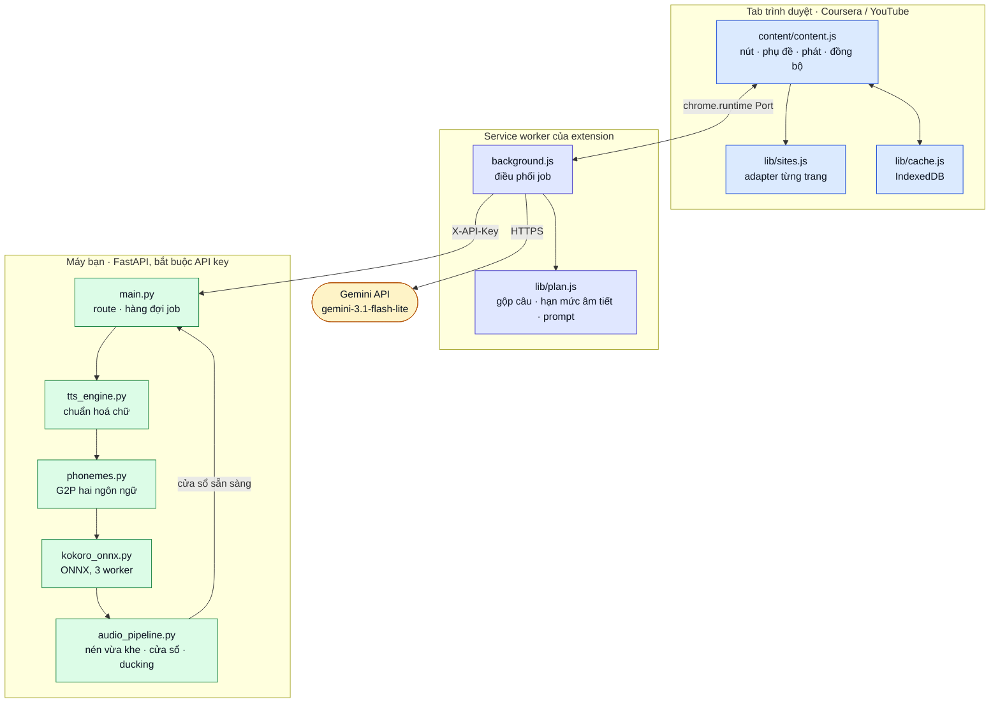
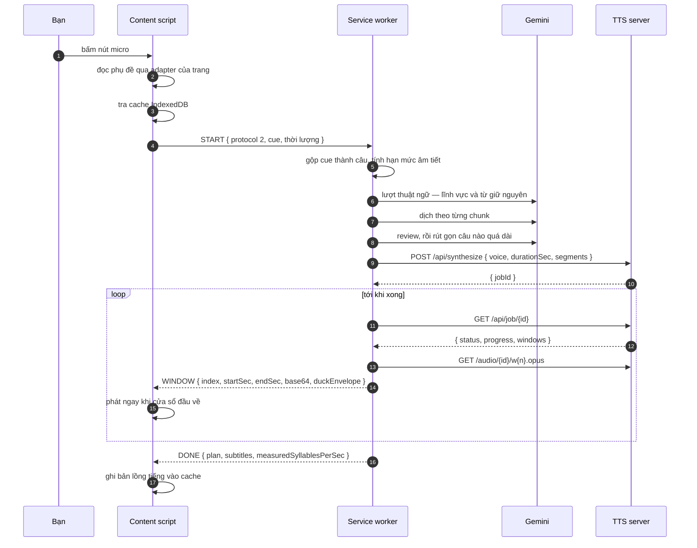
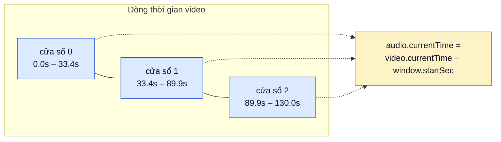
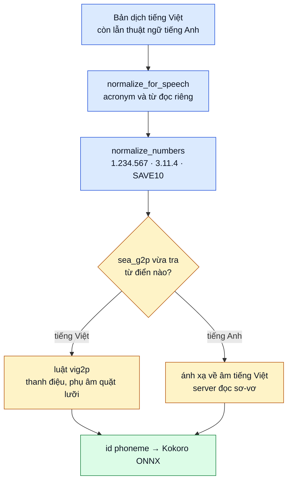
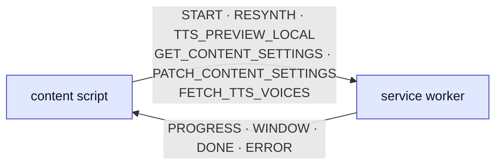
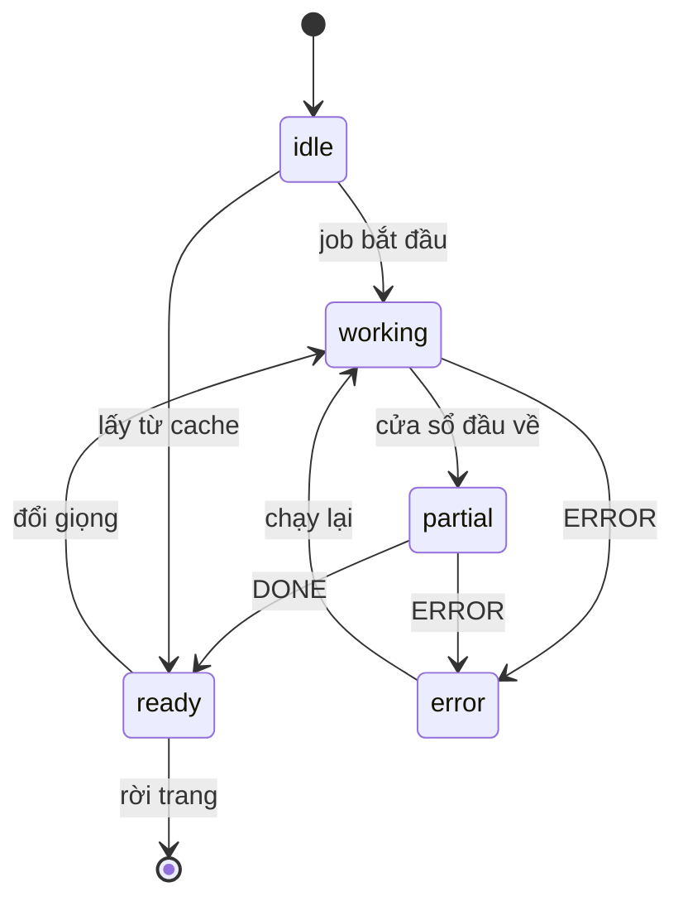

<div align="center">

# Local AI Vietnamese Dubbing

**Xem bài giảng tiếng Anh bằng tiếng Việt — Gemini dịch, giọng đọc chạy ngay trên CPU máy bạn.**

[](#lịch-sử-phiên-bản)
[](LICENSE)
[](extension/manifest.json)
[](server/requirements.txt)
[](#kiểm-thử)

[English](README.md) · [Tài liệu server](server/README.md) · [Chạy trên máy khác](deploy/README.md)

</div>

---

## Mục lục

- [Extension này làm gì](#extension-này-làm-gì)
- [Kiến trúc](#kiến-trúc)
- [Một lần lồng tiếng chạy thế nào](#một-lần-lồng-tiếng-chạy-thế-nào)
- [Neo theo dòng thời gian](#neo-theo-dòng-thời-gian)
- [Chất lượng giọng đọc](#chất-lượng-giọng-đọc)
- [Cấu trúc thư mục](#cấu-trúc-thư-mục)
- [Yêu cầu](#yêu-cầu)
- [Cài đặt](#cài-đặt)
- [Cách dùng](#cách-dùng)
- [Cấu hình](#cấu-hình)
- [API của server](#api-của-server)
- [Bên trong extension](#bên-trong-extension)
- [Hiệu năng](#hiệu-năng)
- [Mô hình bảo mật](#mô-hình-bảo-mật)
- [Kiểm thử](#kiểm-thử)
- [Xử lý sự cố](#xử-lý-sự-cố)
- [Hạn chế đã biết](#hạn-chế-đã-biết)
- [Lịch sử phiên bản](#lịch-sử-phiên-bản)
- [Ghi công và giấy phép](#ghi-công-và-giấy-phép)

---

## Extension này làm gì

Thuyết minh tiếng Việt cho **bài giảng Coursera** và **video YouTube**, khớp đúng dòng thời gian của video.

Nó đọc phụ đề tiếng Anh sẵn có, dịch qua Gemini API chính thức, tổng hợp giọng nói bằng Kokoro-Vietnamese ONNX ngay trên máy bạn, rồi phát chồng lên video. Tua tới đâu cũng đúng ngay: audio được neo theo mốc thời gian tuyệt đối, nên nhảy tới bất kỳ đâu chỉ là một phép gán chứ không phải nạp lại bộ đệm.

**Dữ liệu ở lại máy bạn.** Chỉ phần chữ của phụ đề được gửi tới Gemini. Giọng nói tổng hợp trên chính CPU của bạn sau một lần tải model — bản dịch không đi tới dịch vụ giọng nói nào, video và audio không rời khỏi máy.

|                                |                                                                                                                                        |
| ------------------------------ | -------------------------------------------------------------------------------------------------------------------------------------- |
| **Nghe được sau ~4 giây**      | Audio về theo cửa sổ ~30 giây và phát ngay trong lúc phần sau còn đang tổng hợp, thay vì chờ ~80 giây cho cả bài                        |
| **Giữ được nhạc nền**          | Nhạc, tiếng vỗ tay, hiệu ứng vẫn nghe thấy: tiếng gốc được hạ xuống dưới giọng thuyết minh theo đường bao lấy từ chính bản lồng tiếng   |
| **Chỉ cần CPU**                | 0,23–0,32× thời gian thực trên laptop 6 nhân, ba câu tổng hợp song song. Không GPU, không PyTorch                                       |
| **Đọc đúng chữ lẫn số lẫn Anh**| Chữ số được đọc thành lời, còn thuật ngữ tiếng Anh được đọc theo cách người Việt đọc thay vì áp luật chính tả tiếng Việt lên chúng      |
| **Phụ đề song ngữ**            | Tiếng Việt kèm bản gốc tiếng Anh, kéo thả được, ba cỡ chữ và ba bộ màu                                                                 |
| **Tự hiệu chỉnh**              | Server đo tốc độ đọc thật của giọng sau mỗi lần chạy và trả về, nên câu dịch được cấp đúng số âm tiết audio thật sự chứa được           |
| **Có cache**                   | Bài đã lồng tiếng một lần thì lần sau phát ngay, không tốn thêm lượt gọi API nào                                                       |

---

## Kiến trúc

Ba tiến trình, một cái ở xa. Trình duyệt giữ giao diện và việc phát, server trên máy giữ model, Gemini là thứ duy nhất cần mạng.



---

## Một lần lồng tiếng chạy thế nào



Các bước ứng với phần trăm hiện trên bảng: dựng timeline 5, thuật ngữ 8–10, dịch 12–50, review 49–52, rút gọn 51, tổng hợp 55–95.

---

## Neo theo dòng thời gian

Mỗi câu giữ đúng mốc bắt đầu tuyệt đối của cue phụ đề sinh ra nó. Bản lồng tiếng được ghép lên một track im lặng dài đúng bằng video, rồi cắt thành cửa sổ khoảng 30 giây. Ranh giới cửa sổ luôn rơi vào đầu một câu, và cửa sổ 0 bắt đầu từ giây 0 chứ không phải từ câu đầu tiên — nhờ vậy chỉ cần một phép trừ là biết phát ở đâu.



**Số đo, không phải phỏng đoán.** Đưa 14 câu ở các mốc biết trước qua `plan_windows` và `assemble_timeline`, rồi dò lại điểm bắt đầu của từng câu trong track đã ghép: sai số lớn nhất là **một sample — 0,04 ms** ở 24 kHz. Các cửa sổ phủ kín video, không hở và không chồng lấn.

Lúc đang phát, trang giữ độ khớp đó:

| Lệch giữa bản lồng tiếng và video | Xử lý                                              |
| --------------------------------- | -------------------------------------------------- |
| dưới 40 ms                        | để yên — vùng chết                                 |
| 40–300 ms                         | chỉnh `playbackRate` tối đa ±5%, tai không nhận ra |
| trên 300 ms                       | gán thẳng lại `currentTime`                        |

Vòng kiểm tra chạy mỗi 250 ms, và chạy thêm khi có `seeking`, `ratechange`, `play`. Tua không bao giờ là vấn đề đồng bộ: công thức cho ra vị trí đúng ngay lập tức.

**Nhét câu vào đúng khe.** Câu dài hơn khoảng trống trước câu kế được đọc lại bằng tốc độ native của Kokoro (tối đa 1,15×, giữ nguyên ngữ điệu), vẫn dư thì nén bằng `atempo`, và chỉ cắt bớt khi hết cách. Mỗi câu được mượn khoảng lặng phía sau nó, nên phần lớn câu không cần tới bước nào ở trên.

**Ducking.** Server lấy đường bao RMS từ chính bản lồng tiếng (20 khung/giây, lên 0,08 s, xuống 0,40 s) và gửi kèm mỗi cửa sổ. Trang nhân âm lượng gốc của video với đường bao đó: 0,10 khi đang đọc, 0,35 lúc nghỉ, nên nhạc và tiếng vỗ tay vẫn còn.

---

## Chất lượng giọng đọc

Chữ đi qua ba bước trước khi tới model, vì áp thẳng G2P tiếng Việt lên câu lẫn tiếng Anh thì đọc sai cả hai phía.



**Chữ số.** `vig2p` không có cách đọc cho chữ số — `1000` ra chuỗi phoneme `→000`. Giờ mọi chữ số được đổi thành lời trước khi vào G2P: số có dấu phân nhóm (`1.234.567`), số phiên bản (`3.11.4`), số thập phân, và dạng chữ dính số như `SAVE10`.

**Từ tiếng Anh.** `sea_g2p` tra từng từ một và vốn đã trả về IPA tiếng Anh cho `server`, IPA tiếng Việt cho `chúng`. Hỏng nằm ở bước sau: `vig2p.fix_phonemes` áp luật tiếng Việt lên mọi từ, mà nó coi `ɜ` là dấu thanh — đúng thứ sea_g2p dùng để đánh dấu thanh sắc. Trong tiếng Anh, `ɜː` lại là một nguyên âm thật:

| Từ       | Trước                                  | Sau              |
| -------- | -------------------------------------- | ---------------- |
| server   | `ʂˈ↗ːvɚ` — nguyên âm biến thành thanh  | `sˈəvə`, "sơ-vơ" |
| learning | `lˈ↗ːnɪŋ` — mất sạch nguyên âm         | `lˈəniŋ`         |
| save     | `ʂˈeɪv` — *s* quặt lưỡi kiểu tiếng Việt| `sˈeiv`          |

Vế thứ hai là bản thân giọng đọc. Đối chiếu 585 từ tiếng Việt có dấu lấy từ chính repo này, sea_g2p không hề sinh ra `ʊ ʌ ð ɚ ɾ ᵻ ʒ ɑ ɡ`, cũng không có `iː uː oʊ aɪ aʊ dʒ`. Model có ô từ vựng cho chúng nhưng chưa từng nghe trong lúc học, nên phát ra thứ không đoán trước được. Vì vậy phoneme tiếng Anh được viết lại bằng bộ âm mà giọng này biết — `machine` đọc "ma-sin", `the` đọc "đờ". Từ mơ hồ giữa hai thứ tiếng (`set`, `map`) vẫn đi đường tiếng Việt, vì hai bên đọc như nhau.

---

## Cấu trúc thư mục

```
extension/                  Chrome MV3, không cần build
├── manifest.json           Quyền, trang được tiêm content script, phiên bản
├── background.js           Service worker: job, Gemini, gọi TTS server
├── content/                Giao diện trên trang, phát audio, phụ đề, đồng bộ
├── options/                Trang Cài đặt
├── popup/                  Popup trên thanh công cụ: phụ đề, âm lượng, giọng
└── lib/
    ├── plan.js             Gộp câu, hạn mức âm tiết, dựng prompt
    ├── sites.js            Adapter từng trang (Coursera, YouTube)
    ├── windows.js          Cửa sổ nào phủ mốc thời gian, độ lợi ducking
    ├── vtt.js              Đọc WebVTT và tìm phụ đề
    ├── cache.js            Cache bản lồng tiếng trong IndexedDB
    └── theme.js            Xử lý giao diện sáng/tối dùng chung

server/                     TTS server FastAPI, chỉ API
├── main.py                 Route, hàng đợi job, vòng đời, giới hạn
├── auth.py                 X-API-Key cho mọi route
├── tts_engine.py           Chuẩn hoá chữ, đọc số, xuất WAV
├── phonemes.py             G2P cho câu lẫn hai thứ tiếng
├── kokoro_onnx.py          Inference ONNX chỉ bằng numpy
├── audio_pipeline.py       Nén vừa khe, cắt cửa sổ, đường bao ducking
└── .env.example            Mọi thiết lập, có giải thích

tests/                      44 test JavaScript + 65 test Python
deploy/                     Chạy server trên máy khác
```

---

## Yêu cầu

- **Chrome** 116 trở lên (Manifest V3)
- **Python** 3.12
- **ffmpeg** trong `PATH` — thiếu là server từ chối khởi động
  - Windows: `winget install Gyan.FFmpeg`
  - Debian/Ubuntu: `apt install ffmpeg`
  - macOS: `brew install ffmpeg`
- Một **Gemini API key** ([aistudio.google.com](https://aistudio.google.com/apikey))
- Khoảng 300 MB cho model Kokoro, tải một lần ở lần chạy đầu

---

## Cài đặt

### 1. TTS server

```bash
cd server
python -m venv .venv
.venv/Scripts/pip install -r requirements.txt      # Windows
# .venv/bin/pip install -r requirements.txt        # macOS/Linux

copy .env.example .env                             # Windows
# cp .env.example .env                             # macOS/Linux
```

Sinh một API key rồi điền vào `server/.env`. Server từ chối khởi động nếu để trống, vì bất kỳ thứ gì mở được socket tới nó đều gọi được:

```bash
python -c "import secrets; print(secrets.token_hex(16))"
```

Chạy server:

```bash
.venv/Scripts/python main.py
```

Chờ dòng `Engine sẵn sàng: Kokoro-Vietnamese ONNX (CPU, local)`. Lần chạy đầu sẽ tải model.

### 2. Extension

1. Mở `chrome://extensions`
2. Bật **Developer mode**
3. **Load unpacked** → chọn thư mục `extension/`
4. Mở **Cài đặt** của extension và điền:
   - **Gemini API key**
   - **Server URL** — mặc định `http://127.0.0.1:18765`
   - **Server API key** — đúng giá trị `API_KEY` trong `server/.env`
5. Bấm **Kiểm tra server** và **Nạp giọng** để chắc chắn đã kết nối được

> Sau khi sửa code extension, phải tải lại extension **và** tải cứng lại tab video (Ctrl+Shift+R). Chrome không thay được content script đã tiêm vào tab đang mở; extension phát hiện lệch phiên bản và báo ra, thay vì chạy một job không bao giờ phát được.

---

## Cách dùng

1. Mở bài giảng Coursera hoặc video YouTube có phụ đề tiếng Anh
2. Bấm nút micro trong thanh điều khiển của trình phát
3. Audio bắt đầu ngay khi cửa sổ đầu về, thường khoảng 4 giây

Trên Coursera, bật phụ đề (CC) trước. Trên YouTube extension tự mở bảng transcript; nếu bảng đó đang ở ngôn ngữ khác tiếng Anh thì đổi lại rồi bấm lần nữa.

Chấm màu trên nút cho biết đang ở bước nào mà không cần mở gì:

| Màu                       | Nghĩa                                      |
| ------------------------- | ------------------------------------------ |
| vàng, nhấp nháy           | đang dịch hoặc tổng hợp, chưa nghe được gì |
| xanh dương, nhấp nháy     | đang phát, phần còn lại vẫn đang tổng hợp  |
| xanh lá                   | xong toàn bộ, hoặc lấy từ cache            |
| đỏ                        | lỗi — bảng nổi nói rõ lý do                |

Bấm vào nút khi đã có bản lồng tiếng thì bảng điều khiển mở ra: đổi giữa tiếng gốc và bản thuyết minh, bật tắt từng lớp phụ đề, chỉnh hai mức âm lượng, hoặc đổi giọng — đổi giọng chỉ tổng hợp lại, không dịch lại.

---

## Cấu hình

### Extension — trang Cài đặt

| Thiết lập                      | Mặc định                 | Ghi chú                                                 |
| ------------------------------ | ------------------------ | ------------------------------------------------------- |
| Gemini API key                 | —                        | bắt buộc; model cố định là `gemini-3.1-flash-lite`      |
| Server URL                     | `http://127.0.0.1:18765` | TTS server nào truy cập được cũng dùng được            |
| Server API key                 | —                        | phải trùng `API_KEY` trong `server/.env`               |
| Giọng đọc                      | `diem_trinh`             | 14 giọng Kokoro, lấy danh sách qua `GET /api/voices`   |
| Âm tiết mỗi giây               | `3.8`                    | tự hiệu chỉnh sau mỗi lần chạy; chỉ sửa khi muốn ép    |
| Phụ đề                         | Việt bật, Anh bật        | vị trí, cỡ chữ và bộ màu nằm trong popup               |
| Âm lượng thuyết minh / tiếng nền | 1.0 / 1.0              | tiếng nền được nhân với đường bao ducking              |

### Server — `server/.env`

| Biến                 | Mặc định     | Công dụng                                                        |
| -------------------- | ------------ | ---------------------------------------------------------------- |
| `API_KEY`            | —            | **bắt buộc**; mọi route đều kiểm `X-API-Key`                     |
| `HOST`               | `127.0.0.1`  | địa chỉ lắng nghe                                                |
| `PORT`               | `18765`      | cổng                                                             |
| `LOG_LEVEL`          | `INFO`       | mức log                                                          |
| `KOKORO_VOICE`       | `diem_trinh` | giọng mặc định                                                   |
| `JOB_RETENTION_MIN`  | `60`         | job xong bao nhiêu phút thì audio bị xoá                         |
| `MAX_PENDING_JOBS`   | `4`          | số job chờ/đang chạy trước khi `/api/synthesize` trả 429         |
| `MAX_BODY_MB`        | `16`         | trần body, tính theo số byte thật nhận được                      |
| `ENABLE_DOCS`        | `0`          | Swagger UI; tắt vì các route đó không khoá được bằng API key     |
| `SYNTH_WORKERS`      | `3`          | số câu tổng hợp song song                                        |
| `SYNTH_TIMEOUT_SEC`  | `300`        | trần cho một câu; quá ngần này là coi engine đã kẹt              |
| `FFMPEG_TIMEOUT_SEC` | `120`        | trần cho mỗi lần gọi ffmpeg                                      |
| `ORT_THREADS`        | không đặt    | chốt số thread onnxruntime khi chạy trong container giới hạn CPU |

---

## API của server

Mọi route đều cần `X-API-Key`. Audio là 24 kHz mono; cửa sổ ở dạng Opus, rơi về MP3 nếu ffmpeg thiếu libopus.

| Route                       | Công dụng                                              |
| --------------------------- | ------------------------------------------------------ |
| `GET /api/health`           | `{ ok, status: loading \| ready \| error, model }`     |
| `GET /api/voices`           | danh sách giọng và giọng mặc định                      |
| `POST /api/preview`         | nghe thử một câu, trả thẳng WAV, không qua hàng đợi    |
| `POST /api/synthesize`      | mở một job, trả `{ jobId }`                            |
| `GET /api/job/{id}`         | bản ghi job, kèm các cửa sổ đã công bố                 |
| `DELETE /api/job/{id}`      | huỷ job đang chạy và xoá audio của nó                  |
| `GET /audio/{id}/w{n}.opus` | một cửa sổ đã xong (`.mp3` khi không có Opus)          |

**Request** — `POST /api/synthesize`

```jsonc
{
  "voice": "diem_trinh",
  "durationSec": 612.4,        // > 0, tối đa 21600 (6 giờ)
  "segments": [                // 1 tới 5000 phần tử, id không trùng
    { "id": 0, "start": 0.0, "end": 4.2, "vi": "Xin chào..." }
  ]
}
```

**Bản ghi job** — `GET /api/job/{id}`

```jsonc
{
  "status": "queued | running | done | error | cancelled",
  "progress": 0.62,
  "windows": [
    {
      "index": 0,
      "startSec": 0.0,
      "endSec": 33.4,
      "url": "/audio/ab12.../w0.opus",
      "duckEnvelope": { "fps": 20, "data": "base64 uint8 độ lợi" }
    }
  ],
  "error": null,
  "cancelled": false
}
```

**Mã trạng thái**

| Mã   | Khi nào                                                   |
| ---- | --------------------------------------------------------- |
| 401  | thiếu hoặc sai `X-API-Key`                                |
| 413  | body vượt `MAX_BODY_MB`                                   |
| 422  | timestamp sai, câu dịch rỗng, id segment trùng nhau       |
| 429  | đã đủ `MAX_PENDING_JOBS` job chờ hoặc đang chạy           |
| 503  | model còn đang tải, hoặc engine đã bị đánh dấu hỏng       |
| 507  | đĩa không đủ chỗ cho audio của job này                    |

---

## Bên trong extension

Content script và service worker nói chuyện qua một `chrome.runtime` Port. Hai bên đều mang `PROTOCOL_VERSION`, hiện là `2` — tải lại extension sẽ để lại content script cũ trong các tab đang mở, và bước bắt tay từ chối chúng trước khi tiêu bất kỳ lượt gọi API tính tiền nào.



Trạng thái nút bám theo job chứ không theo phần trăm tiến độ — bản trước từng sáng xanh lá trong lúc còn đang dịch:



Phần phát giữ một thẻ `<audio>` cho mỗi cửa sổ. Cửa sổ có thể về không đúng thứ tự nên được chèn theo mốc bắt đầu; object URL được theo dõi và thu hồi bằng tay, vì gỡ thẻ `<audio>` không giải phóng blob.

---

## Hiệu năng

Đo trên Ryzen 5 5600H (6 nhân), chỉ CPU, bài giảng 10 phút gồm 50 câu:

|                                |                                                          |
| ------------------------------ | -------------------------------------------------------- |
| Thời gian tới tiếng đầu tiên   | ~4,1 s (36,4 s trước khi có phát dần)                    |
| Hệ số thời gian thực           | 0,232 với 3 worker, 0,397 với 1                          |
| RAM đỉnh, video 2 giờ          | 0,6 MB cho bước ghép, không phụ thuộc độ dài             |
| Dung lượng server sau cài      | 282 MB (1079 MB trước khi bỏ torch và gradio)            |
| Vỡ tiếng trong bộ thử          | 0/8 câu (8/8 trước khi chuẩn hoá đỉnh theo từng câu)     |
| Sai số đặt câu                 | 1 sample, 0,04 ms                                        |

---

## Mô hình bảo mật

- **Mọi route đều cần API key.** `X-API-Key` được so bằng `secrets.compare_digest` trên bytes, và server không khởi động nếu key trống.
- **Swagger mặc định tắt.** `/docs`, `/redoc`, `/openapi.json` là route Starlette thuần, dependency không phủ được, nên `ENABLE_DOCS` gác chúng.
- **Body bị chặn theo số byte thật**, không tin `Content-Length` — client tự khai được, còn body chunked thì không có header đó.
- **Voicepack là pickle không tin được.** Lúc nạp chỉ cho phép dựng lại tensor, và mọi view `as_strided` đều bị kiểm tra nằm gọn trong storage.
- **Đĩa được kiểm trước khi làm** — job không đủ chỗ bị từ chối bằng 507 thay vì làm đầy ổ.
- **Job huỷ được và tự hết hạn.** Đóng tab là job bị huỷ, audio đã xong bị xoá sau `JOB_RETENTION_MIN`, thư mục còn sót được dọn lúc khởi động.
- **Không có gì ngoài chữ của phụ đề rời khỏi máy**, và chỉ đi tới Gemini.

---

## Kiểm thử

```bash
node --test tests/*.test.js
server/.venv/Scripts/python -m unittest discover -s tests -t tests
```

44 test JavaScript và 65 test Python. Nhóm JavaScript chạy chính `background.js` và `content.js` thật trong `vm` với `chrome`, `fetch` và DOM giả lập, nên kiểm đúng code sẽ chạy chứ không phải bản sao. Nhóm Python phủ API, pipeline audio và phần G2P hai ngôn ngữ.

---

## Xử lý sự cố

| Hiện tượng                          | Nguyên nhân và cách xử lý                                                     |
| ----------------------------------- | ----------------------------------------------------------------------------- |
| "giao thức v1, extension đang là v2"| content script trong tab cũ hơn lần tải lại — tải cứng lại tab video          |
| Server thoát ngay khi khởi động     | chưa có `API_KEY` trong `server/.env`, hoặc ffmpeg không nằm trong `PATH`     |
| Server trả 401                      | server API key trong extension khác với `server/.env`                        |
| "không tìm thấy phụ đề"             | video không có phụ đề tiếng Anh; với YouTube thì bảng transcript phải mở được |
| Tải model đứng giữa chừng           | chỉ ở lần đầu, ~300 MB từ Hugging Face; chạy lại là tiếp tục                  |
| Giọng đọc nghe gấp gáp              | giảm âm tiết mỗi giây trong Cài đặt; server tự đo lại sau mỗi lần chạy        |

---

## Hạn chế đã biết

- Mới có adapter cho Coursera và YouTube. Udemy tạm để lại, chưa làm.
- Mốc thời gian trong transcript YouTube chỉ chính xác tới giây, nên câu ở đó có thể lệch tới một giây. WebVTT của Coursera thì chính xác.
- Chất lượng dịch là chất lượng của Gemini; thuật ngữ dịch sai vẫn sai nếu lượt thuật ngữ không bắt được.
- Một giọng cho cả bài — không nhận biết đổi người nói trong nguồn.
- Tua qua ranh giới cửa sổ, đổi giọng giữa chừng và phát lại từ cache đã có test phủ nhưng chưa kiểm bằng tay trên trình duyệt thật.

---

## Lịch sử phiên bản

| Phiên bản | Thay đổi                                                                                                                                                                        |
| --------- | --------------------------------------------------------------------------------------------------------------------------------------------------------------------------------- |
| **0.4.0** | Phát dần theo cửa sổ ~30 giây, tổng hợp song song, ducking giữ nhạc nền, adapter YouTube, đèn trạng thái theo màu, đọc số tiếng Việt, đọc đúng từ tiếng Anh, bắt tay phiên bản giao thức |
| 0.3.0     | Ghép theo luồng (RAM không phụ thuộc độ dài), huỷ job, kiểm đĩa trước, trần thời gian tổng hợp, API key cho mọi route                                                            |
| 0.2.0     | Bỏ torch, transformers, gradio — inference ONNX chỉ bằng numpy, 1079 MB xuống 282 MB                                                                                             |
| 0.1.0     | Pipeline chạy được đầu tiên: phụ đề Coursera, dịch bằng Gemini, một file audio cho cả bài                                                                                        |

---

## Ghi công và giấy phép

Giọng đọc dùng [Kokoro-Vietnamese](https://huggingface.co/contextboxai/Kokoro-Vietnamese) (Apache-2.0), phần chuyển chữ sang âm dùng [vig2p](https://pypi.org/project/vig2p/) trên nền `sea-g2p`. Bộ icon lấy từ [Lucide](https://lucide.dev) (MIT).

**Hà Trọng Nguyễn** — [github.com/htrnguyen](https://github.com/htrnguyen)

Thuộc **AIAI Lab** — [github.com/AIAI-Laboratory](https://github.com/AIAI-Laboratory)

Bản quyền © 2026 Hà Trọng Nguyễn, AIAI Lab. Phát hành theo [Apache License 2.0](LICENSE) — cùng giấy phép với Kokoro-Vietnamese, thứ mà `server/kokoro_onnx.py` viết lại một phần.
