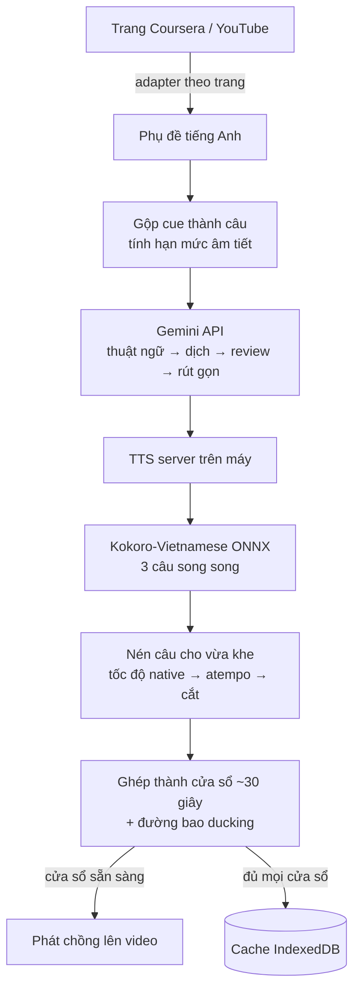

<div align="center">

# Local AI Vietnamese Dubbing

**Xem bài giảng tiếng Anh bằng tiếng Việt — Gemini dịch, giọng đọc chạy ngay trên CPU máy bạn.**

[](#lịch-sử-phiên-bản)
[](LICENSE)
[](extension/manifest.json)
[](server/requirements.txt)
[](#kiểm-thử)

[English](README.md) · [Tài liệu server](server/README.md) · [Triển khai](deploy/README.md)

</div>

---

## Extension này làm gì

Thuyết minh tiếng Việt cho **bài giảng Coursera** và **video YouTube**, khớp đúng dòng thời gian của video.

Nó đọc phụ đề tiếng Anh sẵn có, dịch qua Gemini API chính thức, tổng hợp giọng nói bằng Kokoro-Vietnamese ONNX ngay trên máy bạn, rồi phát chồng lên video. Tua tới đâu cũng đúng ngay: audio được neo theo mốc thời gian tuyệt đối, nên nhảy tới bất kỳ đâu chỉ là một phép gán chứ không phải nạp lại bộ đệm.

**Dữ liệu ở lại máy bạn.** Chỉ phần chữ của phụ đề được gửi tới Gemini để dịch. Giọng nói tổng hợp trên chính CPU của bạn sau một lần tải model — bản dịch không đi tới dịch vụ giọng nói nào, video và audio không rời khỏi máy.

### Điểm chính

| | |
|---|---|
| 🎧 **Nghe được sau ~4 giây** | Audio về theo cửa sổ ~30 giây và phát ngay trong lúc phần sau còn đang tổng hợp, thay vì chờ ~80 giây cho cả bài |
| 🎚️ **Giữ được nhạc nền** | Nhạc, tiếng vỗ tay, hiệu ứng vẫn nghe thấy: tiếng gốc được hạ xuống dưới giọng thuyết minh theo đường bao lấy từ chính bản lồng tiếng, không mute hẳn |
| ⚡ **Chỉ cần CPU** | 0,23–0,32× thời gian thực trên laptop 6 nhân, ba câu tổng hợp song song. Không GPU, không PyTorch |
| 📝 **Phụ đề song ngữ** | Tiếng Việt kèm bản gốc tiếng Anh, kéo thả được, ba cỡ chữ và ba bộ màu |
| 🔁 **Tự hiệu chỉnh** | Server đo tốc độ đọc thật của giọng sau mỗi lần chạy và trả về, nên câu dịch được cấp đúng số âm tiết mà audio thật sự chứa được |
| 💾 **Có cache** | Bài đã lồng tiếng một lần thì lần sau phát ngay, không tốn thêm lượt gọi API nào |

---

## Cách hoạt động



**Neo theo thời gian tuyệt đối.** Mỗi câu giữ đúng mốc bắt đầu của cue phụ đề sinh ra nó. Bản lồng tiếng được ghép lên một track im lặng dài đúng bằng video, nên `audio.currentTime = video.currentTime − mốc_bắt_đầu_cửa_sổ` luôn đúng — tua xong không cần chỉnh trôi.

**Nhét câu vào đúng khe.** Câu dài hơn khoảng trống trước câu kế sẽ được đọc lại bằng tốc độ native của Kokoro (tối đa 1,15× — giữ nguyên ngữ điệu), vẫn dư thì nén bằng `atempo`, và chỉ cắt bớt khi hết cách. Mỗi câu được mượn khoảng lặng phía sau nó, nên phần lớn câu không cần tới bước nào ở trên.

### Cấu trúc

```
extension/                  Chrome MV3, không cần build
├── background.js           Service worker: điều phối job, Gemini, gọi TTS server
├── content/content.js      Giao diện trên trang, phát audio, phụ đề, đồng bộ
├── lib/plan.js             Gộp câu, hạn mức âm tiết, dựng prompt
├── lib/sites.js            Adapter từng trang (Coursera, YouTube)
├── lib/windows.js          Chọn cửa sổ audio theo mốc thời gian
├── lib/vtt.js              Đọc WebVTT và tìm phụ đề
└── lib/cache.js            Cache bản lồng tiếng trong IndexedDB

server/                     TTS server FastAPI, chỉ API
├── main.py                 Route, hàng đợi job, vòng đời, giới hạn
├── kokoro_onnx.py          Inference ONNX chỉ bằng numpy
├── tts_engine.py           Chuẩn hoá chữ, đọc số, xuất WAV
└── audio_pipeline.py       Nén vừa khe, cắt cửa sổ, đường bao ducking

tests/                      44 test JavaScript + 58 test Python
```

---

## Hình ảnh

<!--
  Bỏ ảnh PNG vào docs/screenshots/ với đúng các tên dưới đây là chúng hiện lên:
    player.png     — nút mic nằm trong thanh điều khiển của player
    subtitles.png  — phụ đề song ngữ trên bài giảng
    controls.png   — bảng nổi: chế độ, phụ đề, âm lượng, giọng đọc
    options.png    — trang Cài đặt của extension
-->

| | |
|---|---|
|  |  |
| Nút mic nằm ngay trong thanh điều khiển của player | Tiếng Việt kèm bản gốc tiếng Anh |
|  |  |
| Chế độ, phụ đề, âm lượng, đổi giọng | Cài đặt: API key, server, tốc độ đọc |

Chấm màu trên nút cho biết đang ở bước nào:

| Màu | Nghĩa |
|---|---|
| 🟡 vàng (nhấp nháy) | đang dịch hoặc tổng hợp, chưa nghe được gì |
| 🔵 xanh dương (nhấp nháy) | đang phát, phần còn lại vẫn đang tổng hợp |
| 🟢 xanh lá | xong toàn bộ, hoặc lấy từ cache |
| 🔴 đỏ | lỗi — bảng nổi nói rõ lý do |

---

## Yêu cầu

- **Chrome** 116 trở lên (Manifest V3)
- **Python** 3.12
- **ffmpeg** trong `PATH` — thiếu là server từ chối khởi động
  - Windows: `winget install Gyan.FFmpeg`
  - Debian/Ubuntu: `apt install ffmpeg`
  - macOS: `brew install ffmpeg`
- Một **Gemini API key** ([aistudio.google.com](https://aistudio.google.com/apikey))
- Khoảng 300 MB cho model Kokoro, tải một lần ở lần chạy đầu

---

## Cài đặt

### 1. TTS server

```bash
cd server
python -m venv .venv
.venv\Scripts\pip install -r requirements.txt      # Windows
# .venv/bin/pip install -r requirements.txt        # macOS/Linux

copy .env.example .env                              # Windows
# cp .env.example .env                              # macOS/Linux
```

Sinh một API key và điền vào `server/.env` — server từ chối khởi động nếu để trống, vì bất kỳ thứ gì mở được socket tới nó đều gọi được:

```bash
python -c "import secrets; print(secrets.token_hex(16))"
```

Chạy server:

```bash
.venv\Scripts\python main.py
```

Chờ dòng `Engine sẵn sàng: Kokoro-Vietnamese ONNX (CPU, local)`. Lần chạy đầu sẽ tải model.

### 2. Extension

1. Mở `chrome://extensions`
2. Bật **Developer mode**
3. **Load unpacked** → chọn thư mục `extension/`
4. Mở **Cài đặt** của extension và điền:
   - **Gemini API key**
   - **Server API key** — đúng giá trị `API_KEY` trong `server/.env`
5. Bấm **Kiểm tra server** và **Tải danh sách giọng** để xác nhận đã kết nối

### 3. Sử dụng

Mở một bài giảng Coursera hoặc video YouTube **có phụ đề tiếng Anh**, rồi bấm nút mic trong thanh điều khiển của player. Với Coursera, bật CC trước. Với YouTube, extension tự mở bảng transcript; nếu bảng đó đang ở ngôn ngữ khác tiếng Anh thì đổi sang English rồi bấm lại.

> **Sau khi sửa code extension, phải reload extension _và_ tải lại trang** (Ctrl+Shift+R). Chrome không thay được content script đã tiêm vào tab đang mở; extension phát hiện lệch phiên bản và báo ra, thay vì chạy một job không bao giờ phát được.

---

## Cấu hình

### Extension (trang Cài đặt)

| Mục | Mặc định | Ghi chú |
|---|---|---|
| Gemini API key | — | Bắt buộc. Model cố định `gemini-3.1-flash-lite` |
| Địa chỉ server | `http://127.0.0.1:18765` | |
| Server API key | — | Phải khớp `API_KEY` trong `server/.env` |
| Giọng đọc | `diem_trinh` | 14 giọng Kokoro |
| Âm tiết mỗi giây | `3.8` | Tự hiệu chỉnh sau mỗi lần chạy; chỉ sửa khi muốn ép giá trị khác |

### Server (`server/.env`)

| Biến | Mặc định | Công dụng |
|---|---|---|
| `API_KEY` | — | **Bắt buộc.** Mọi route đều khoá bằng `X-API-Key` |
| `HOST` / `PORT` | `127.0.0.1` / `18765` | Địa chỉ lắng nghe |
| `KOKORO_VOICE` | `diem_trinh` | Giọng mặc định |
| `SYNTH_WORKERS` | `3` | Số câu tổng hợp song song |
| `SYNTH_TIMEOUT_SEC` | `300` | Quá ngần này cho một câu là coi engine đã kẹt |
| `FFMPEG_TIMEOUT_SEC` | `120` | Trần cho mỗi lần gọi ffmpeg |
| `JOB_RETENTION_MIN` | `60` | Job xong và audio của nó bị dọn sau ngần này phút |
| `MAX_PENDING_JOBS` | `4` | Trần hàng đợi; vượt thì trả HTTP 429 |
| `MAX_BODY_MB` | `16` | Tính theo số byte thật nhận được, không tin header |
| `ENABLE_DOCS` | `0` | Swagger UI không khoá được bằng API key nên mặc định tắt |
| `ORT_THREADS` | không đặt | Chốt số thread onnxruntime khi chạy trong container giới hạn CPU |

### API

Mọi route đều cần `X-API-Key`.

```
GET    /api/health                  loading | ready | error
GET    /api/voices                  danh sách giọng Kokoro
POST   /api/preview                 một câu → WAV, để nghe thử giọng
POST   /api/synthesize              → { jobId }
GET    /api/job/{jobId}             trạng thái, tiến độ, cửa sổ khi sẵn sàng
DELETE /api/job/{jobId}             dừng job đang chạy
GET    /audio/{jobId}/w{i}.{ext}    một cửa sổ ~30 giây, Opus (hoặc MP3)
```

---

## Hiệu năng

Đo trên AMD Ryzen 5 5600H (6 nhân / 12 luồng), bài giảng 6 phút, 50 câu:

| | |
|---|---|
| Dịch (Gemini, 2 chunk) | ~15 giây |
| Tổng hợp, 3 luồng song song | ~45 giây |
| **Thời gian tới lúc nghe được tiếng đầu tiên** | **~4 giây** |
| Hệ số thời gian thực (RTF) | 0,23–0,32× |
| Đỉnh bộ nhớ server, video 2 tiếng | 0,6 MB (xử lý theo dòng, không nạp cả bài) |
| Dung lượng thư viện Python | 282 MB (không torch, transformers hay gradio) |

Số thread và số luồng, cùng máy, cùng tập câu:

| Thread ONNX × luồng | RTF |
|---|---|
| 6 × 1 | 0,397 |
| 3 × 2 | 0,303 |
| 1 × 6 | 0,266 |
| **6 × 3** (mặc định) | **0,232** |

---

## Kiểm thử

```bash
node --test tests/*.test.js                                       # 44 test
server/.venv/Scripts/python -m unittest discover -s tests -t tests  # 58 test
```

Test JavaScript chạy `background.js` và `content.js` thật, với `chrome`, `fetch` và DOM giả lập — một job đi trọn qua service worker, còn content script dựng cửa sổ audio, chuyển giữa chúng và đổi trạng thái đèn. Test Python phủ hợp đồng API (xác thực, giới hạn, vòng đời job, huỷ job), đường ống audio (ghép timeline, ducking, cắt cửa sổ) và bộ đọc voicepack trước các file độc hại.

---

## Lịch sử phiên bản

| Phiên bản | Nội dung chính |
|---|---|
| **0.4.0** | Phát dần theo cửa sổ ~30 giây · tổng hợp song song · huỷ job · đọc số tiếng Việt · đèn màu trạng thái |
| 0.3.0 | Inference ONNX bỏ torch (1079 MB → 282 MB) · ghép timeline theo dòng · siết các lỗ hổng ở rìa request · bộ test |
| 0.2.0 | Hỗ trợ YouTube qua lớp adapter · giữ nhạc nền · mượn khoảng lặng · tự hiệu chỉnh tốc độ đọc |
| 0.1.0 | Coursera, dịch bằng Gemini, tổng hợp Kokoro ONNX, phát neo theo thời gian tuyệt đối |

---

## Hạn chế đã biết

- Chất lượng giọng Kokoro không đồng đều; nên nghe thử từng giọng trên chính tài liệu của bạn.
- Câu vẫn quá dài sau khi tăng tốc và nén sẽ bị cắt bớt; bảng nổi báo có bao nhiêu câu bị cắt.
- Mốc thời gian của YouTube lấy từ bảng transcript, chỉ chính xác tới giây, nên neo kém mịn hơn Coursera (có WebVTT thật).
- Chất lượng dịch phụ thuộc Gemini và phụ thuộc chính phụ đề gốc; phụ đề tự động không dấu câu cho ra câu dài và lỏng lẻo hơn.
- Engine kẹt thì phải khởi động lại server — trần thời gian chỉ báo ra chứ không tự phục hồi.

---

## Ghi công

Phần tổng hợp giọng dùng [Kokoro-Vietnamese](https://github.com/iamdinhthuan/Kokoro-Vietnamese) (Apache-2.0). Lớp inference ONNX trong `server/kokoro_onnx.py` là bản viết lại độc lập đường ONNX của dự án đó, nhằm bỏ các phụ thuộc gradio, torch và transformers; âm thanh phát ra không đổi. Phần chuyển chữ sang phoneme dùng [vig2p](https://pypi.org/project/vig2p/).

---

## Tác giả

**Hà Trọng Nguyên** — [github.com/htrnguyen](https://github.com/htrnguyen)

Thuộc **AIAI Lab** — [github.com/AIAI-Laboratory](https://github.com/AIAI-Laboratory)

## Bản quyền

Bản quyền © 2026 Hà Trọng Nguyên, AIAI Lab.

Phát hành theo [Giấy phép Apache 2.0](LICENSE). Chọn Apache-2.0 vì dự án viết lại một phần Kokoro-Vietnamese, vốn dùng chính giấy phép này.
